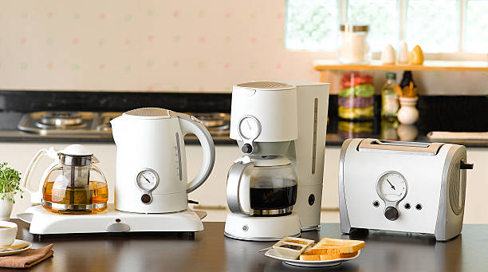

Checker
<!doctype html>
<title>Example</title>

<main class="grid">
  
  <h3> Spacious Living </h3>
  
 Your luxury apment consists of a spacious living area with leather furniture overlooking a private garden for you to enjoy. 

  
  
  
  
  
  
  
  
  
</main>